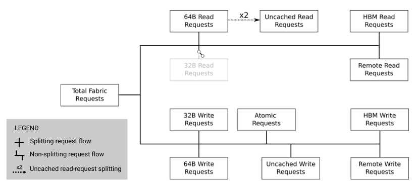

.. meta::
   :description: ROCm Compute Profiler performance model: L2 cache (TCC)
   :keywords: Omniperf, ROCm Compute Profiler, ROCm, profiler, tool, Instinct, accelerator, L2, cache, infinity fabric, metrics

**************
L2 cache (TCC)
**************

The L2 cache is the coherence point for current AMD Instinct™ MI-series GCN™
GPUs and CDNA™ accelerators, and is shared by all :doc:`CUs <compute-unit>`
on the device. Besides serving requests from the
:doc:`vector L1 data caches <vector-l1-cache>`, the L2 cache also is responsible
for servicing requests from the :ref:`L1 instruction caches <desc-l1i>`, the
:ref:`scalar L1 data caches <desc-sL1D>` and the
:doc:`command processor <command-processor>`. The L2 cache is composed of a
number of distinct channels (32 on MI100 and :ref:`MI2XX <mixxx-note>` series CDNA
accelerators at 256B address interleaving) which can largely operate
independently. Mapping of incoming requests to a specific L2 channel is
determined by a hashing mechanism that attempts to evenly distribute requests
across the L2 channels. Requests that miss in the L2 cache are passed out to
:ref:`Infinity Fabric™ <l2-fabric>` to be routed to the appropriate memory
location.

The L2 cache metrics reported by ROCm Compute Profiler are broken down into four
categories:

*  :ref:`L2 Speed-of-Light <l2-sol>`

*  :ref:`L2 cache accesses <l2-cache-accesses>`

*  :ref:`L2-Fabric transactions <l2-fabric>`

*  :ref:`L2-Fabric stalls <l2-fabric-stalls>`

.. _l2-sol:

L2 Speed-of-Light
=================

.. warning::

   The theoretical maximum throughput for some metrics in this section
   are currently computed with the maximum achievable clock frequency, as
   reported by ``rocminfo``, for an accelerator. This may not be realistic for
   all workloads.

The L2 cache’s speed-of-light table contains a few key metrics about the
performance of the L2 cache, aggregated over all the L2 channels, as a
comparison with the peak achievable values of those metrics:

.. jinja:: l2-sol
   :file: _templates/metrics_table.j2

.. note::

   The L2 cache on AMD Instinct MI CDNA accelerators uses a "hit-on-miss"
   approach to reporting cache hits. That is, if while satisfying a miss,
   another request comes in that would hit on the same pending cache line, the
   subsequent request will be counted as a 'hit'. Therefore, it is also
   important to consider the latency metric in the :ref:`L2-Fabric <l2-fabric>`
   section when evaluating the L2 hit rate.

.. _l2-cache-accesses:

L2 cache accesses
=================

This section details the incoming requests to the L2 cache from the
:doc:`vL1D <vector-l1-cache>` and other clients -- for instance, the
:ref:`sL1D <desc-sL1D>` and :ref:`L1I <desc-l1i>` caches.

.. jinja:: l2-cache-accesses
   :file: _templates/metrics_table.j2

.. note::

   All requests to the L2 are for a single cache line's worth of data. The size
   of a cache line may vary depending on the accelerator, however on an AMD
   Instinct CDNA2 :ref:`MI2XX <mixxx-note>` accelerator, it is 128B, while on
   an MI100, it is 64B.

.. _l2-fabric:

L2-Fabric transactions
======================

Requests/data that miss in the L2 must be routed to memory in order to
service them. The backing memory for a request may be local to this
accelerator (i.e., in the local high-bandwidth memory), in a remote
accelerator’s memory, or even in the CPU’s memory. Infinity Fabric
is responsible for routing these memory requests/data to the correct
location and returning any fetched data to the L2 cache. The
:ref:`l2-request-flow` describes the flow of these requests through
Infinity Fabric in more detail, as described by ROCm Compute Profiler metrics,
while :ref:`l2-fabric` give detailed definitions of
individual metrics.

.. _l2-request-flow:

Request flow
------------

The following is a diagram that illustrates how L2↔Fabric requests are reported
by ROCm Compute Profiler:

   L2↔Fabric transaction flow on AMD Instinct MI-series accelerators.

Requests from the L2 Cache are broken down into two major categories, read
requests and write requests (at this granularity, atomic requests are treated
as writes).

From there, these requests can additionally subdivided in a number of ways.
First, these requests may be sent across Infinity Fabric as different
transaction sizes, 32B or 64B on current CDNA accelerators.

.. note::

   On current CDNA accelerators, the 32B read request path is expected to be
   unused and so is disconnected in the flow diagram.

In addition, the read and write requests can be further categorized as:

* Uncached read/write requests, for instance: for access to
  :ref:`fine-grained memory <memory-type>`

* Atomic requests, for instance: for atomic updates to
  :ref:`fine-grained memory <memory-type>`

* HBM read/write requests OR remote read/write requests, for instance: for
  requests to the accelerator’s local HBM OR requests to a remote accelerator’s
  HBM or the CPU’s DRAM

These classifications are not necessarily *exclusive*. For example, a
write request can be classified as an atomic request to the
accelerator’s local HBM, and an uncached write request. The request-flow
diagram marks *exclusive* classifications as a splitting of the flow,
while *non-exclusive* requests do not split the flow line. For example,
a request is either a 32B Write Request OR a 64B Write request, as the
flow splits at this point.

However, continuing along, the same request might be an atomic request and an
uncached write request, as reflected by a non-split flow.

Finally, we note that :ref:`uncached <memory-type>` read requests (e.g., to
:ref:`fine-grained memory <memory-type>`) are handled specially on CDNA
accelerators, as indicated in the request flow diagram. These are
expected to be counted as a 64B Read Request, and *if* they are requests
to uncached memory (denoted by the dashed line), they will also be
counted as *two* uncached read requests (that is, the request is split).

.. _l2-fabric-metrics:

Metrics
-------

 The following metrics are reported for the L2-Fabric interface:

.. jinja:: l2-fabric-metrics
   :file: _templates/metrics_table.j2

.. _l2-detailed-metrics:

Detailed transaction metrics
----------------------------

The following metrics are available in the detailed L2-Fabric
transaction breakdown table:

.. jinja:: l2-detailed-metrics
   :file: _templates/metrics_table.j2

.. _l2-fabric-stalls:

L2-Fabric interface stalls
==========================

When the interface between the L2 cache and Infinity Fabric becomes backed up by
requests, it may stall, preventing the L2 from issuing additional requests to
Infinity Fabric until prior requests complete. This section gives a breakdown of
what types of requests in a kernel caused a stall (like read versus write), and
to which locations -- for instance, to the accelerator’s local memory, or to
remote accelerators or CPUs.

.. jinja:: l2-fabric-stalls
   :file: _templates/metrics_table.j2

.. warning::

   On current CDNA accelerators and GCN GPUs, these L2↔Fabric stalls can be undercounted in some circumstances.

.. rubric:: Footnotes

.. [#inf] In addition to being used for on-accelerator data-traffic, AMD
   `Infinity Fabric <https://www.amd.com/en/technologies/infinity-architecture>`_
   technology can be used to connect multiple accelerators to achieve advanced
   peer-to-peer connectivity and enhanced bandwidths over traditional PCIe
   connections. Some AMD Instinct MI-series accelerators like the MI250X feature coherent CPU-to-accelerator connections are built using AMD Infinity Fabric. For more information, see the `AMD CDNA2 white paper <https://www.amd.com/content/dam/amd/en/documents/instinct-business-docs/white-papers/amd-cdna2-white-paper.pdf>`_.

.. rubric:: Disclaimer

PCIe® is a registered trademark of PCI-SIG Corporation.
